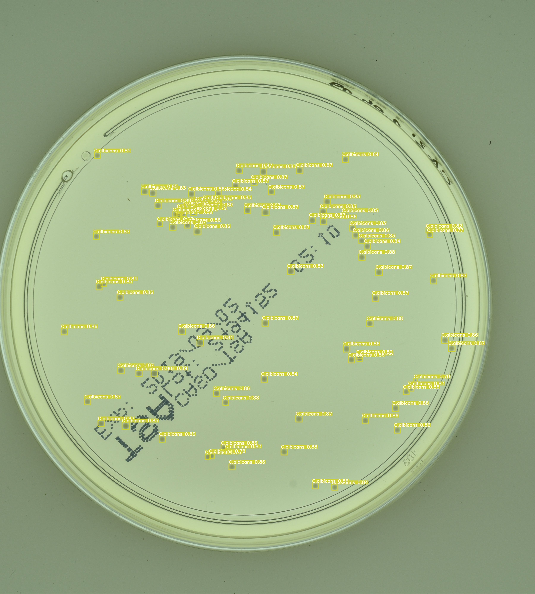
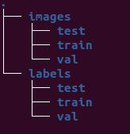
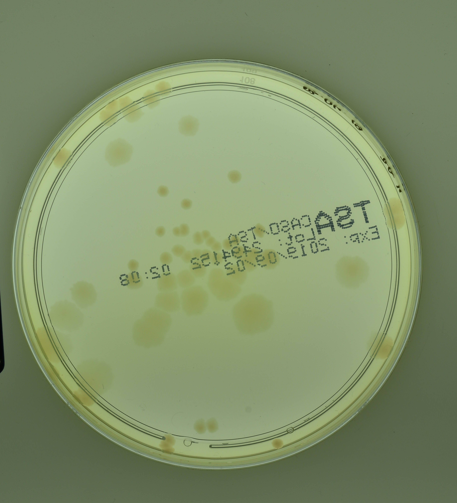
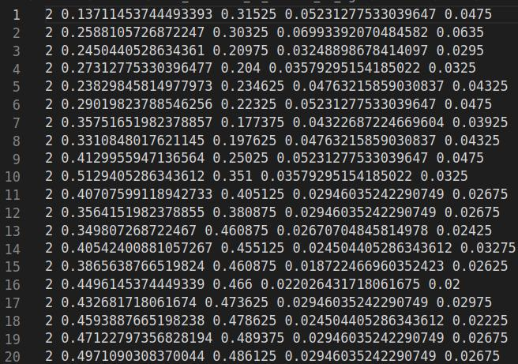
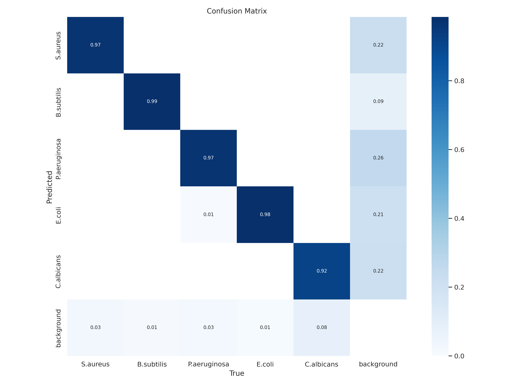
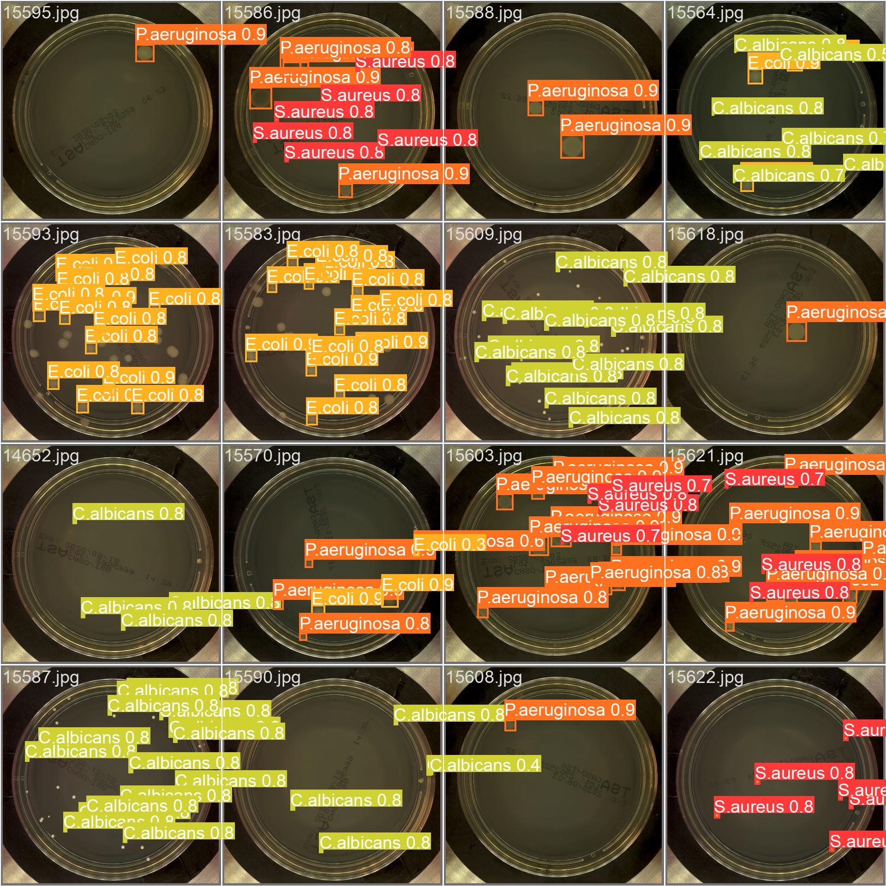
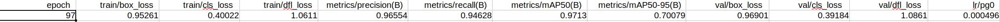

# YOLO Based Bacterial Object Detection 

#### Team Members
Dietrich Nigh

#### Summary of Repository Contents:
* NeuroSYS Research provided the data for this content on a academic license.
    * Data consisted of 18,000 images containing five different microorganisms as well as accompanying annotations of colonies.
        * _S.aureus_
        * _B.subtilis_
        * _P.aeruginsoa_
        * _E.coli_
        * _C.albicans_
* [Exploratory Notebooks](notebooks/) from each member of this group
* A copy of our [final presentation](FinalPresentation.pdf) in PDF format
* A copy of our [final notebook](FinalNotebook.ipynb) containing detailed analysis and accompanying code

## Business Understanding of the Problem

Since the discovery of bacteria in the 17th century, scientists have been trying to identify and classify those tiny specs under the microscope. In the 19th century, Julius Richard Petri, a German physician working under the famous Robert Koch, developed his namesake, the Petri dish, for this purpose. He needed to reliably grow bacteria without risk of containmination so he could accurately study his specimens. Since that time, the classification of bacteria has come a long way. Many bacterial samples can be sequenced to elucidate all of their secrets. That said, the Petri dish is still a critical tool in the culturing and classification of bacterial samples. 

Presently, the identification of bacteria is a laborious and time consuming task. This is not to mention the years of training needed to properly perform the task. Even still mistakes can be made. To reduce the cost (both in time and money), recent years have seen an explosion of research into the construction machine learning models to correctly identify bacteria from a sample. Agar plates (Petri dishes with agar media) are a widely available, affordable, and effective means of growing isolated samples. If a model could be made to quickly and accurately differiante bacteria based on their growth, medical diagnostics could be done quickly with less training for technicians. For research applications, time spent memorizing such works as Bergey's Manual could be diverted elsewhere.

The model chosen for this task is YOLO. YOLO is a single stage object detection model from Ultralytics with many hidden layers. YOLO is a single stage detector, meaning it performs regression around the object of interest and the classification of said image in parallel. This makes it much faster than dual-stage detectors, like Faster RCNN, which perform these tasks sequentially. The model is also relatively lightweight once trained. The model was developed for such tasks as live object detection after all. With this model we were able to construct a highly precise model.

#### Limitations of Our Data

* Dataset was relatively small
* Dataset only contained five species of bacteria

## Bottom Line

Bacterial classification is essential for many medical and research diagnostics, yet it is massively time consuming and laborious. 

## Data Preparation
Data was filtered for blank agar plates, leaving me with 12,272 images. The data was then split into train, test, and validation sets: 6903 train, 2301 validation, 3068 test images. With the use of YOLO, data formatting was extremely important. As such, annotations were converted from a generic format to [Kitti format](https://github.com/bostondiditeam/kitti/blob/master/resources/devkit_object/readme.txt). From Kitti format, the data was then converted to YOLO format. The directories were also constructed in a format understandable to YOLO (see tree image below).

###### Example Image:

###### Example Labels in Kitti format:

## Baseline Model

The baseline model was a 3 epoch YOLO model. This model netted a relatively low performing model.

Metrics: 

* __mAP50__ = 0.552
* __mAP50-95__ = 0.306

If you require an explanation of these results, please see [here](https://blog.paperspace.com/mean-average-precision/).

## Exploratory Modeling
For my second model, I improved on our first model, using the pretrained weights from the YOLO repository, I performed a 10 epoch training regement. This vastly improved my performance.

Metrics: 

* __mAP50__ = 0.891
* __mAP50-95__ = 0.570

## Final Model
The final model took the pre-trained weights from the 10 epoch model and continued to train this for a another [97 epochs](models_train/97epoch.pt) [using these paramaters](images/args.yaml). This model performed very well on the validation data. The mAP50 score was 0.971 and the mAP50-95 score was 0.701. The classification recall was 0.946. Below you can find the precision-call curve (the closer to the top right corner, the 'better' the model performed), the confusion matrix, as well as an example of validation images with their predicition scores.

###### Precision Recall Curve:

###### Confusion Matrix:

###### Example Output:

#### Final Model Deployment
The final model was then deployed via [Flask](https://palletsprojects.com/p/flask/). [The application](webapp.py) has a basic interface due to my inexperience using html. Here is a basic summary of it's capabilities:
* Take in .jpg, .jpeg, or .png files
* Return an annotated copy of the image to the user
    * Page includes:
        * Image with bounding boxes (different colors for different species)
        * Per class count of colonies on the plate
        * Legend of bounding box colors 
* A home button for another round of object detection

Below is a demostration of the application in action:

https://user-images.githubusercontent.com/80785218/232555226-9a4f5260-d528-4ff0-b833-52442fe9c9d7.mp4

The [bacteria_env](bacteria_env) is required for this application to run properly.

#### Results
My final YOLO model takes images as input and consists of __many__ hidden layers. The first layer is a convolutional layer that applies a set of filters to the input image to detect certain features in the image. The output is then passed to the next layer to detect more complicated features. This continues until the final output layer. YOLO utilizes parrellel processing of the image to classify objects as well as regress around the objects. This allows the model to be much faster than dual stage detectors such as faster RCNN. For those of you interested, here is [Ultralytic's github](https://github.com/ultralytics/ultralytics). 

During training, the model continues to refine the layers and adjust the weight of specific neurons until it can no longer improve itself. After 10 epochs of no improvement, the model will stop itself and save the model at whichever epoch had the highest score. My model precede to run for 87 epochs before leveling out and stopping itself at 97 epochs. This model was then saved and utilized in the application deployment. 

After training, the test set is introduced to the model to test the score on unseen data. Here are the final scores:

Metrics: 

* __mAP50__ = 0.971
* __mAP50-95__ = 0.701

This represents a 76% and 129% improvement over the baseline in mAP50 and mAP50-95 respectively.

Below is a summary of all results:

